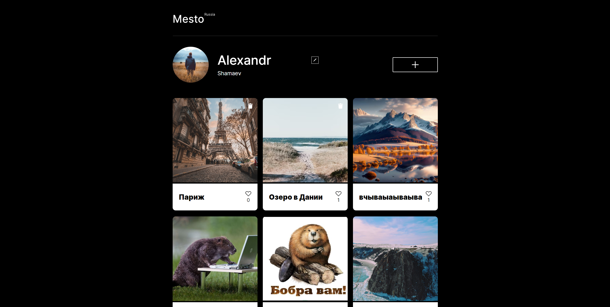

# Проектная работа Mesto

* Ссылка на репозиторий https://github.com/x7eon/mesto-project-ff.git

* Посмотреть проект можно по ссылке: https://x7eon.github.io/mesto-project-ff/

* В данной проектной работе реализован функционал:
1. валидации всех форм
2. подключен интерфейс к API
3. cайт опубликован на сервере 

* Скриншот проекта
